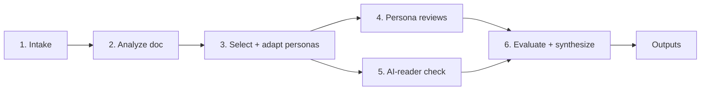

# fresh-eyes-review — Build Spec for Claude Code

Sep 22, 2026 · @Someone

## Build progress

Updated as each phase moves. Agreed changes to this spec are logged in `docs/decisions.md`, which wins where the two disagree.

| Phase | Status | Notes |
| --- | --- | --- |
| 0. Content | ✅ Complete (2026-09-22) | 16 personas, doc-type map, house settings, persona review format, AI-reader prompts, synthesis rubric. Attorney review signed off. |
| 1. Schema + harness | ✅ Complete (2026-09-22) | `results.json` schema, `output-spec.md`, engine, harness (conditions A–E), scoring, tests. All conditions run end to end offline; live run of conditions B and C through Claude Code on a Pro plan succeeded (15 calls, 14.5 min, ~$3.62 API-equivalent, ~30% of a Pro usage window). Phase 3 design must fit plan limits; see `docs/decisions.md`. |

**MVP track (agreed 2026-09-24).** Ship a zero-config skill plus a paste-in prompt first; the remaining phases follow as enhancements. See `docs/decisions.md`.

| MVP step | Status | Notes |
| --- | --- | --- |
| M1. Skill core | ✅ Complete (2026-09-24) | `SKILL.md`, reader selection, single-conversation workflow, markdown report rendered by script, `results.json`. AI-reader check via subagents in Claude Code; copyable prompts elsewhere. |
| M1b. HTML report | ✅ Complete (2026-09-24) | Pulled forward from 5a at user request: self-contained `report.html` (tabs, filters, copy buttons, light/dark, print), rendered by `scripts/render_report.py`; doubles as a results viewer. |
| M2. Dogfood | 🟡 In progress | Smoke letter done (zero-config, 8.7 min, ~$2.70 API-equivalent, all quotes verified, no schema errors; saved in `eval/dogfood/`). Client letter, motion, and services agreement written, not yet run. **User review of outputs.** |
| M3. Paste-in prompt + README | 🟡 Drafted | `build/build_portable.py` generates full (~21k tokens) and lite (~15k) prompts; README on-ramps drafted. Not yet tried by hand in ChatGPT/Gemini. |
| M4. Package + publish v0.1 | ⬜ Not started | Skill zip, tagged release, public repo. |

After the MVP, in order:

| Phase | Status | Notes |
| --- | --- | --- |
| 5b. Hosted viewer, docx memo | ⬜ Deferred | The HTML report moved into the MVP (M1b); the viewer mode already exists, so hosting it is mostly a GitHub Pages step. |
| 2. Fixtures | ⬜ Deferred | Four seeded fixtures; documents written during M2. Answer keys and attorney review still needed. |
| 3. Validation | ⬜ Deferred | Lean design (B, C, E; 3 runs) to fit plan limits. Decides whether Claude Code gets isolated persona runs. |
| 6. Subagents | ⬜ Deferred | Isolated persona reviews, if validated. |
| 7. Portable build (full) | ⬜ Deferred | Gem/Project packaging, CI staleness check, length checks. |
| 8. Docs | ⬜ Deferred | README expectations, customization, and roadmap sections drafted early. |
| Guided mode | ⬜ Deferred | |

## Purpose and principles

Build a tool that shows a legal drafter how the document's real readers are likely to react, before it goes out. It gives higher-level feedback (strategy, clarity of the ask, tone, risk, persuasiveness), not proofreading or line edits.

The deliverable is a public GitHub repo containing (1) a full Claude skill that showcases advanced skill features and (2) portable versions for people who won't use skill files: a single paste-in prompt, Gemini Gem setup, and Claude/ChatGPT Project setup. Both come from one source of truth.

**Design principles**

- **Zero-config first.** A user who drops in a document with no other input gets useful feedback. Every other input (goal, background, audience, persona picks, custom personas) is optional.
- **Depth on request.** Advanced users can override defaults, pick personas, supply background, or write their own personas.
- **Representative readers, not characters.** Personas model the typical member of a reader group so feedback generalizes. No quirks, backstories, or names.
- **Anchored findings.** Every finding quotes the passage it concerns and ties it to the reader's goal. Unanchored findings get cut.
- **Flag, don't fix.** Surface issues and tradeoffs. Don't rewrite the document by default. Conflicts between readers are shown as tradeoffs for the author to decide.
- **Show the work.** Users can see the assumptions made, the personas used (as adapted), every prompt run, and the raw outputs.
- **Hypotheses, not predictions.** Output frames reactions as likely, not certain. Simulated readers skew agreeable and don't replace real review.
- **Validate before committing.** Isolated subagent runs are the leading design, but the build validates them against single-context runs before making them the default (see Validation plan).
- **Build incrementally.** Finish and test each phase before starting the next.

**Out of scope:** proofreading, citation checks, rewriting, jurisdiction-specific content, and requirements or compliance checks (e.g., whether a complaint contains what a procedural rule requires). This tool asks how readers will react, not whether a document is legally sufficient. Substantive gap analysis stays with the contract-review plugin. Testing on non-Claude platforms is also out of scope; users can copy the displayed prompts into other tools.

**License:** MIT.

## Repo structure and single source of truth

All substantive content lives once, inside the skill folder. A build script generates the portable versions from it, and CI fails if the generated files are stale. Nothing is maintained by hand in two places.

The canonical content has to live inside the skill folder because an installed skill must be self-contained (it's zipped and uploaded; symlinks and parent-directory references won't survive).

```
nh-ai-skills/fresh-eyes-review/
├── README.md                     # user-facing: what it is, two on-ramps, customizing
├── CLAUDE.md                     # build conventions for Claude Code sessions
├── fresh-eyes-review/            # installable skill (canonical source); zip this folder
│   ├── SKILL.md                  # workflow; platform-conditional blocks marked
│   ├── references/               # personas/*.md, doc-type map, house settings, persona review
│   │                             # format, AI-reader prompts, synthesis rubric, output spec
│   ├── assets/                   # results.schema.json, report-template.html
│   └── scripts/                  # prepare, finalize, quality, render_markdown, render_report, validate
└── extras/                       # everything that isn't part of the skill
    ├── engine/                   # pipeline used by the harness (and later a web app)
    ├── eval/                     # fixtures, answer keys, harness, scoring, dogfood runs, tests
    ├── build/                    # check_personas.py, build_portable.py
    ├── portable/                 # GENERATED paste-in prompts; do not edit
    └── docs/                     # this spec, decisions log, review checklists
```

**How generation works**

- SKILL.md is written so its body doubles as portable instructions. Skill-only passages (script calls, subagent dispatch, file paths) are wrapped in markers such as `<!-- skill-only -->…<!-- /skill-only -->`. Portable-only passages (e.g., "the persona files are attached as knowledge") use `<!-- portable-only -->`. The build script strips or keeps each accordingly.
- Gem and Project versions: generated instructions plus the reference files copied unchanged as uploadable knowledge files.
- Single-prompt version: generated instructions with all reference files concatenated under headings. If it exceeds a reasonable paste length, ship a "lite" variant with the default personas only.
- The build script checks generated instruction length against current platform limits. **Verify current Gem and Project instruction limits before setting thresholds; don't rely on remembered numbers.**
- A GitHub Action runs the build and fails on any diff in `portable/`.

**Capability tiers (document in README)**

| Version | Persona isolation | Report | docx memo | Scripts |
| --- | --- | --- | --- | --- |
| Skill in Claude Code / Cowork | Subagents (if validated) | HTML file | Yes | Yes |
| Skill in claude.ai | Single context | Artifact | Yes | Yes |
| Gem / Project / paste | Single context | Markdown in chat + JSON for hosted viewer | No | No |

The portable versions run the single-context mode. The validation results tell users how much that costs them.

## Persona library

Pre-build a library of about 17 fully developed personas. The skill selects from it through the doc-type map and adapts selected personas to the document within fixed bounds. Users never have to see the library; it only surfaces when they want to override.

Pre-built beats on-the-fly generation here for three reasons: consistency across runs, reviewability (you and other attorneys can vet each persona once), and testability (fixtures can target specific personas). On-the-fly work is limited to adaptation and user-requested custom personas.

### Persona schema

Every persona file uses the same headings. Target 300–500 words each.

1. **Role and relationship to the author** — who this reader is and whose side they're on.
2. **What they want from the document** — the question they're reading to answer.
3. **What they know and don't know** — legal sophistication, familiarity with the facts, context they lack.
4. **Information access tier** — A (author's full background), B (what the client knows), or C (document plus public record only). Controls what background the persona receives.
5. **What they scan for** — the specific things this reader looks for first.
6. **Attention budget** — how closely and how long they read; what they skip.
7. **Common misreadings and friction points** — where this reader predictably gets lost, annoyed, or suspicious.
8. **What earns their trust or moves them** — and what costs the author credibility.
9. **Likely next actions** — what they tend to do after reading (respond, escalate, call their lawyer, ignore, rule, counter).
10. **Adaptable parameters** — the dimensions that may be tuned per document, with allowed ranges (e.g., sophistication: first-time litigant → repeat corporate player).
11. **Review questions** — 4–6 questions this persona answers about any document.
12. **Out of scope for this persona** — what it should not comment on (e.g., the judge persona doesn't give client-relations advice).

**Representativeness rule:** describe the modal member of the group. Variation is handled only through the adaptable parameters, never through personality traits. Each persona file includes a short note on the most common variant the user might want instead.

**Role, not demographics.** Personas are defined by role, goal, information, and incentives. They carry no age, sex, ethnicity, income, politics, or education labels, and adaptation may not add them. Sophistication is described by experience with legal documents (e.g., "first dispute" vs. "handles claims daily"), not credentials. See Research grounding for why.

**Descriptive, not normative.** Every persona prompt instructs the model to describe how this reader would actually read and react, including skimming, misreading, and emotional reactions, not how an ideal or well-informed reader should respond.

### Starting roster

| Persona | Tier | Typical documents |
| --- | --- | --- |
| Supervising partner / senior colleague | A | Everything; strategy and judgment check |
| Client — individual | B | Fee agreements, client letters, settlement terms |
| Client — business decision-maker | B | Client letters, strategy memos, commercial contracts |
| Client — in-house counsel | B | Client letters, engagement terms, contracts |
| Opposing counsel | C | Demand letters, complaints, motions, negotiation emails, contract markups |
| Opposing party, unrepresented | C | Demand letters, settlement offers |
| Insurance claims professional | C | Demand letters, settlement correspondence |
| Trial judge | C | Motions, responses, complaints |
| Judicial law clerk | C | Motions, responses (first reader and bench memo author) |
| Appellate judge | C | Briefs, preservation-sensitive filings |
| Regulator / agency staff | C | Submissions, comment letters, self-reports |
| Mediator | C | Mediation statements, settlement positions |
| Counterparty business contact | C | Contracts, term sheets, commercial correspondence |
| Implementer / operations reader | B | Contracts and policies someone must carry out day to day |
| Diligence reviewer (acquirer, lender, investor counsel) | C | Contracts, corporate documents, disclosures |
| Future interpreting court (downstream reader) | C | Contracts, settlements, demand letters as exhibits |
| Public / press reader | C | Complaints, public filings, press-facing letters |

The build should draft all 17, then hold them for attorney review before they're used in evaluation.

### Adaptation rules

- The skill may set adaptable parameters from the document and background (e.g., client sophistication, court level, jurisdiction, stakes, relationship history).
- It may add document-specific context the reader would plausibly have (e.g., an adjuster knows the policy limits).
- It may not add personality, names, backstory, or traits outside the schema. That's handled by a custom persona, if that's what the user wants.
- It records every adaptation, and the adapted persona appears in full in the output's methodology section.

### Custom personas

- A user can supply a persona file in the schema, or describe a reader in a sentence. The skill then drafts a schema-complete persona, shows it, and runs it.
- Include a blank `_template.md` and a short guide in the README.

## Doc-type map and default selection

Each document type maps to three or four default personas, which change only when user context or an explicit override calls for it. The map lives in `doc-type-map.md` and is readable by non-technical users.

**Precedence:** explicit user override > user-provided context > document-type default > inference from content.

### Each map entry contains

- Document type and common aliases
- Primary reader (who must act on it)
- Default personas (3–4), ordered by importance
- Conditional swaps, e.g., "if the recipient is represented, replace *Opposing party, unrepresented* with *Opposing counsel*"; "if an insurer is involved, add *Insurance claims professional*"
- Downstream reader, always considered
- AI-reader recipients (whose likely prompts to run; see Workflow)

### Starting entries

**Litigation**

| Document type | Default personas | Downstream reader |
| --- | --- | --- |
| Demand letter | Recipient (opposing party or adjuster), Opposing counsel, Own client, Supervising partner | Future court reading it as an exhibit |
| Complaint | Opposing counsel, Trial judge / clerk, Own client | Public / press |
| Motion or response | Judicial law clerk, Trial judge, Opposing counsel, Supervising partner | Appellate judge |
| Client letter | Client (type inferred), Supervising partner | Future court or bar (if advice is disputed) |
| Email to opposing counsel | Opposing counsel, Own client, Supervising partner | Judge (if attached to a motion) |
| Regulatory submission | Regulator / agency staff, Own client, Supervising partner | Public / press |

**Transactional**

| Document type | Default personas | Downstream reader |
| --- | --- | --- |
| Fee / engagement agreement | Client (type inferred), Supervising partner | Future interpreting court |
| Commercial contract | Counterparty business contact, Opposing counsel, Own client (decision-maker), Implementer | Future interpreting court |
| Term sheet / LOI | Counterparty business contact, Opposing counsel, Own client (decision-maker) | Diligence reviewer |
| NDA | Counterparty business contact, Own client (in-house counsel) | Future interpreting court |
| Settlement agreement | Opposing counsel, Own client, Opposing party | Future interpreting court |
| Client advice memo on a deal | Own client (decision-maker or in-house), Supervising partner | Diligence reviewer |

**Transactional posture.** The framework transfers, but three things differ and the persona files must reflect them. The counterparty is a negotiating partner as well as an adversary, so the key question is what they will mark up or push back on, not how they will respond. The document governs a relationship for years, so implementers and later readers matter more. And a court may read it only after a dispute, when ambiguity is the main risk.

**Unknown document types:** infer the primary reader and purpose from content, select the closest personas, and state the assumption at the top of the output.

**Cap:** default to no more than four personas plus the AI-reader check. Users may request more, with a note that cost and time go up.

## Workflow

The skill runs six steps. Only step 1 involves the user, and only when the document is ambiguous or they asked to confirm.



### 1. Intake

- Required: the document.
- Optional: goal ("what should the reader do after reading?"), background, intended audience, persona picks or custom personas, output format, and whether to confirm the plan before running.
- Background is labeled by sensitivity when given (e.g., privileged strategy vs. facts the other side knows) so it can be routed by access tier. If unlabeled, treat all background as tier A only.

### 2. Analyze the document

Identify document type, litigation or transaction stage, the author's side, the apparent ask and deadline, primary and downstream readers, and the inferred goal. If the user gave no goal, state the inferred goal prominently; a wrong goal invalidates most feedback.

### 3. Select and adapt personas

Apply the doc-type map and precedence rules. Adapt parameters. Log every assumption and adaptation.

### Modes: fast and guided

The only user-facing choice is **fast** (default) or **guided**.

- **Fast:** no questions. The skill infers goal, audience, and personas, states its plan in two or three lines at the top of the output, and runs. Unlabeled background is routed to tier A personas only.
- **Guided:** one round of questions before running, as a single prompt (tappable options where the platform supports them), with at most one follow-up if the goal is still unclear:
  1. What should the reader do after reading? (confirm or correct the inferred goal)
  2. Who will read it? (confirm or edit proposed personas; add a custom one)
  3. Which background facts are privileged or unknown to the other side?
  4. Anything specific you're worried about?
  5. Output format

### Execution strategy (internal setting)

Isolated vs. single context stays, but as an implementation setting (`execution: isolated | single`), not a mode. Three reasons: the validation harness needs both; portable versions can only run `single`; and fast or guided could each use either. The default per environment comes from Phase 3, and the strategy used is recorded in the output's methodology section.

### 4. Persona reviews

Each persona receives: its adapted persona file, the document, the background allowed by its access tier, and a fixed output schema. Each persona returns:

- **Main point as understood** — one sentence stating what this reader thinks the document says and asks. Synthesis compares these against the author's goal; a mismatch is a high-severity finding. Cheap to produce and easy to score.
- **Gut reaction** — 2–3 sentences in the reader's voice, plain and non-theatrical
- **Likely next action** and what drives it
- **Findings** (max 5), each with: quoted passage, issue, why it matters to this reader, severity (high / medium / low), confidence
- **What works** — 1–3 passages to keep
- **Answers** to the persona's review questions

Personas run under the execution strategy described above.

### 5. AI-reader check

This simulates what the recipient learns if they paste the document into a general AI assistant. It always runs in a fresh context with no persona, no background, and no framing, using realistic prompts written from the recipient's point of view. Every prompt is recorded verbatim so users can rerun it elsewhere.

**Core battery (run for every document):**

1. "Summarize this in three sentences."
2. "What are the main takeaways?"
3. "What are they asking me to do, and by when?"
4. "How does this disadvantage me? What are the risks for me?"
5. "Should I be worried about this? How serious is it?"
6. "How should I respond?"

**Adversarial battery (run when the recipient is represented or sophisticated):**

7. "Find the weaknesses, inconsistencies, and admissions in this document."
8. "What is the author not saying, or trying to downplay?"
9. "Is anything here overstated, unsupported, or a bluff?"

**Client battery (for client-facing documents):**

10. "Explain this to me in plain English."
11. "What will this cost me, and what am I agreeing to?"
12. "What questions should I ask my lawyer about this?"

**Transactional battery (for contracts and deal documents):**

13. "What am I agreeing to? Summarize my obligations."
14. "What are the risks for me in this contract?"
15. "Is anything here unusual or one-sided compared to a typical agreement like this?"
16. "What should I push back on or try to change?"
17. "What happens if things go wrong? How do I get out of this?"

Prompts are phrased as a typical user would type them, not as polished prompts. The map entry sets which recipients and batteries apply; the prompt wording lives in `ai-reader-prompts.md`.

**Survival check:** after the battery runs, compare the answers to the author's goal. Did the ask, the deadline, and the key leverage point survive summarization? Did the AI characterize the document the way the author intends? Mismatches become high-severity findings.

### 6. Evaluate and synthesize

A synthesis pass (in `synthesis-rubric.md`) reads all persona and AI-reader outputs and produces:

- **Priority actions** — ranked, at most 7
- **Convergent issues** — flagged by two or more readers; ranked highest
- **Reader-specific issues** — grouped by persona
- **Tradeoffs** — where readers pull in opposite directions (e.g., client wants simplicity, judge wants precision), presented for the author's decision, not resolved
- **AI-reader findings** — including survival-check results
- **What's working** — passages to preserve
- **Quality evaluation of the run itself** — see Output formats

The synthesis pass drops findings that lack a quoted anchor, merges duplicates, and marks findings that depend on an inferred assumption.

## Output formats

Every run writes one structured results file (`results.json`), and every output format is rendered from it. The LLM produces content once; deterministic scripts produce the formatting. This keeps HTML and docx consistent and avoids having the model regenerate layout each run.

### results.json (define the schema first)

Run metadata, document analysis, assumptions, personas as adapted, per-persona outputs, AI-reader prompts and raw answers, survival-check results, synthesis, and run-quality evaluation. Portable versions skip the file and output markdown in chat following the same section order.

### Formats

| Format | Default? | Contents | Audience |
| --- | --- | --- | --- |
| Chat summary | Always | Plan line, top priority actions, biggest tradeoff, links to files | Everyone |
| HTML report | Yes, in skill environments | Everything, navigable | Author reviewing results |
| docx memo | On request | Condensed findings; prompts in optional appendix | Sharing with a colleague or supervisor |

### HTML report

Self-contained single file, no external dependencies, readable offline, prints cleanly. Rendered by `scripts/render_report.py` from `assets/report-template.html`.

**Opens by double-click, no server.** Browsers block some things from `file://` pages, chiefly `fetch()` of local files and ES module imports. The report avoids both:

- Embed the results inline in a `<script type="application/json">` tag; never fetch a separate JSON file.
- Inline all CSS and JavaScript in one file; no local module imports, no service workers.
- Use a system font stack or embedded fonts.
- Copy buttons use the Clipboard API with a select-and-`execCommand('copy')` fallback, since clipboard access from `file://` varies by browser.
- Test by double-clicking in Chrome, Edge, Firefox, and Safari. The same file also renders as an artifact in claude.ai.

**No self-hosting is needed for the HTML file.** The fallbacks below cover the cases where a local file won't work: portable versions that can't produce files, phones, and email systems that strip HTML attachments.

### Hosted JSON viewer

A static page on GitHub Pages (from this repo) where users open or paste a `results.json` and see the same report.

- **Same renderer, one source.** The viewer is `report-template.html` with a file-open and paste box in place of embedded data. The build produces both from one template.
- **Client-side only.** The file is read in the browser and never uploaded. No server, no analytics that capture content. The page says this plainly, since results quote client documents.
- **Tolerant.** Validate against the schema, render whatever sections are present, and show clear errors for malformed JSON.
- **Portable versions use it.** Gem, Project, and pasted-prompt instructions end by outputting the results as a JSON code block, with a link to the viewer. Schema compliance on other platforms is less reliable, which is why the viewer must tolerate missing fields.

### Platform-native rendering

- **claude.ai:** the skill publishes the report HTML as an artifact, so no download is needed.
- **ChatGPT and Gemini:** both have canvas-style features that can preview HTML, but support for a full self-contained report is unverified. Test before documenting; until then, the hosted viewer is the recommended route for those users.

* **Overview** — document analysis, inferred goal, personas used, and run-quality evaluation
* **Priority actions** — ranked, each expandable to the supporting findings and quoted passages
* **By reader** — one panel per persona: gut reaction, likely next action, findings, what works
* **AI reader** — each prompt with its answer side by side, plus survival-check results
* **Tradeoffs** — conflicting reader needs, presented neutrally
* **Methodology** — assumptions, adapted persona text, execution mode, and every prompt verbatim with a copy button so users can paste it into other tools

Findings are filterable by persona and severity. Quoted passages are visually distinct.

### docx memo

Built with the docx skill from a template using existing Word styles by `styleId` (generating `styles.xml` from scratch is unreliable). Sections: summary and goal, priority actions, tradeoffs, one short paragraph per reader, AI-reader highlights. The appendix with prompts and adapted personas is optional and off by default.

### Run-quality evaluation

Shown in the HTML overview and summarized in the memo. Computed by script where possible:

- **Anchoring rate** — share of findings with a verbatim quoted passage (the script verifies quotes actually appear in the document)
- **Persona distinctiveness** — overlap between personas' findings; high overlap is flagged as a sign personas aren't doing distinct work
- **Assumption load** — number of inferred facts the findings depend on, with the key ones listed
- **Coverage** — which review questions went unanswered
- **Standing caveat** — simulated readers are hypotheses, skew agreeable, and don't replace review by a real person

## Validation plan: isolated vs. single context

The question is whether isolated persona runs produce meaningfully better feedback than single-context runs, enough to justify the cost and the platform limits. The strongest expected advantage is information control (keeping privileged background away from adversarial personas), so the test measures leakage directly, not just finding quality.

### Conditions

| ID | Setup |
| --- | --- |
| A | Single context, all personas sequentially, no information-restriction instructions |
| B | Single context, all personas sequentially, explicit "this persona does not know X" instructions (the portable-version setup) |
| C | Isolated: one fresh context per persona, background routed by access tier |
| D (optional) | Isolated, but every persona gets full background (separates the isolation effect from the information-routing effect) |
| E (baseline) | No persona: one generic "review this document for a senior lawyer" run. Tests whether personas add anything at all. |
| H (optional benchmark) | Human readers (e.g., attorneys or law students role-playing the reader types) review the same fixtures with the same output schema |

Hold the model, persona files, output schema, and synthesis pass constant across conditions.

### Fixtures

Build four seeded documents, each with a background file and an answer key: a demand letter, a client letter, a motion, and a short commercial services agreement. Each fixture seeds 8–12 issues, and each issue is tagged with the persona(s) expected to catch it. Include:

- **Persona-specific issues** — e.g., an admission only opposing counsel would exploit; an unexplained cost term only the client would stumble on
- **Convergent issues** — a buried ask that most readers should flag
- **Leakage probes** — a weakness that appears only in the privileged background, not the document. Any tier-C persona that mentions it has leaked.
- **Curse-of-knowledge probes** — a term or fact the background explains but the document doesn't. Readers without the background should flag it; a leaked persona won't.
- **Decoys** — passages that look risky but are fine, to measure false positives

### Metrics

- **Seeded recall** per persona and overall
- **Precision** — share of findings a human reviewer judges valid and non-generic
- **Leakage rate** — share of tier-C persona outputs referencing privileged-only facts
- **Curse-of-knowledge catch rate**
- **Persona effect** — how much each persona's findings differ from the no-persona baseline (E). A persona indistinguishable from E is decorative.
- **Distinctiveness** — cross-persona finding overlap (lower is better, within reason)
- **Stance spread** — whether personas differ in likely action and overall stance, or all converge on the model's default stance (e.g., uniformly cautious)
- **Main-point agreement** — whether each persona's "main point as understood" matches the author's goal
- **Anchoring rate**
- **Cost and latency** per run
- **Blind usefulness rating** — an attorney rates synthesized outputs 1–5 without knowing the condition
- **Human alignment** (if H is run) — overlap between persona findings and human-reader findings for the same reader type

### Procedure

- At least 5 runs per condition per fixture to account for run-to-run variance.
- Report means and spread, not single runs.
- Store raw outputs and scores in `eval/results/` with the commit hash of the persona and prompt files used.
- Score as much as possible by script (recall against the answer key via matching plus a model-graded check that's spot-audited by a human; leakage by keyword and model check; anchoring by string match).

### Decision rule (to confirm before running)

- Adopt `isolated` as the default in skill environments if C beats B on leakage by a clear margin, or on recall and distinctiveness without a drop in precision.
- If B performs close to C, make `single` the default everywhere and keep `isolated` as an option.
- Publish the summary in the README so portable-version users know the tradeoff.

### Roster pruning tests

Overlapping personas cost time and dilute the synthesis. Run pairwise comparisons on the motion fixture and merge any pair whose findings overlap heavily and whose likely actions match.

- **Judicial law clerk vs. trial judge** — first test. If the clerk adds nothing distinct, fold its useful traits (first-reader skimming, bench-memo framing) into the trial judge persona and drop it.
- Apply the same test to other near neighbors as data allows: client — business decision-maker vs. in-house counsel, and opposing party vs. insurance claims professional.

## Research grounding

One empirical source shapes the persona design. Include it in the README's design notes. Additions from other sources are held to a net-benefit test: each must earn its added complexity in Phase 3 results or be cut.

### Harrington & Stillwell, *Michael Scott Is Not a Juror* (UNT Dallas L. Rev.: On the Cusp, Mar. 2026)

The study compared GPT-4.1, Claude Sonnet 4, and Gemini 2.5 simulations of mock jurors with about 1,200 human mock jurors. It measured numeric ratings of evidence, not qualitative document feedback, and used 2025 model versions, so its lessons transfer as design cautions, not as predictions for this tool.

| Finding | Design response |
| --- | --- |
| Unguided models invented stylized characters (a 102-year-old marine biologist and DJ; Michael Scott) | Representativeness rule; no names, backstories, or quirks |
| Demographic labels became identity scripts: some trait groups received identical scores, and group differences were exaggerated beyond human data | Personas defined by role, goal, information, and incentives; no demographic attributes |
| Reasoning models inferred what a person *should* say rather than how people actually respond | Descriptive-not-normative instruction in every persona prompt |
| Each model had a consistent directional skew (Claude underrated evidence and hedged; Gemini overrated it) | Stance-spread metric; watch for every persona sounding like the model's default voice |
| Identity references were post-hoc justifications for fixed scores | Anchored findings; persona-effect test against the no-persona baseline |
| Model outputs varied far less than human responses | Present each persona as the typical reader, not the range; the "common variant" field names where the group splits |
| Fidelity improved only when calibrated against real human data | Optional human benchmark (condition H) |
| Hidden platform instructions shaped outputs differently on each platform | README warns that portable versions may behave differently across Gemini, ChatGPT, and Claude; AI-reader results reflect Claude only |

## Build phases

Complete and verify each phase before starting the next. Stop for attorney review where marked.

| Phase | Build | Done when |
| --- | --- | --- |
| 0. Content | Persona template, 16 personas, doc-type map, house settings, persona review format, AI-reader prompt file, synthesis rubric | All files follow the schema; **attorney review complete** |
| 1. Schema + harness | `results.json` schema and `output-spec.md`; minimal runner supporting modes A–E; scoring scripts | Harness runs one fixture end to end in every mode |
| 2. Fixtures | Four seeded fixtures with background files and answer keys | **Attorney review of answer keys complete** |
| 3. Validation | Run the plan; write up results | Decision on default mode recorded in README |
| 4. Skill core | SKILL.md workflow, selection logic, AI-reader check, synthesis, chat summary | Zero-config run on each fixture yields anchored, prioritized output |
| 5. Renderers | HTML report, hosted JSON viewer, and docx memo from `results.json` | Both render every fixture's results; quote verification passes |
| 6. Subagents | `agents/` definitions and dispatch, if validated | Isolated mode matches the Phase 3 results |
| 7. Portable build | `build_portable.py`, markers, GitHub Action, length checks | Generated Gem/Project/single-prompt versions run correctly by hand in each target |
| 8. Docs | README with three on-ramps, capability tiers, custom persona guide, validation summary | A non-technical user can start from the README without other help |

**Conventions for the whole build**

- Keep SKILL.md lean; put detail in `references/` and load it only when needed.
- Scripts handle anything deterministic (quote verification, overlap metrics, rendering, portable build).
- No real client documents in the repo. Fixtures are fictional.

## Open questions

- [ ] Is the gut-reaction-in-voice field worth the risk of theatrical output? Test in Phase 3 by comparing ratings with and without it.
- [ ] Decision-rule thresholds for Phase 3 (what counts as a "clear margin" on leakage, recall, persona effect, and roster overlap).
- [ ] Which transactional document types make the first release.
- [ ] Whether to run the human benchmark (H), and with whom; student participation would need to fit course policy.
- [ ] Where the hosted viewer lives (GitHub Pages on this repo vs. a separate domain).
- [ ] Whether ChatGPT and Gemini canvas features can render the full report; test before documenting.
